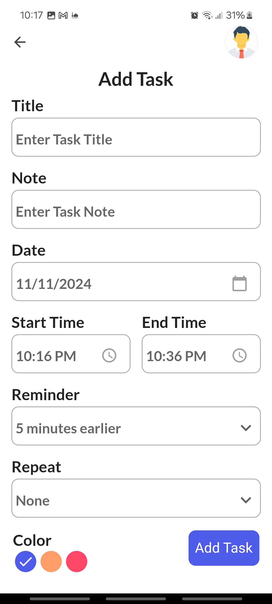
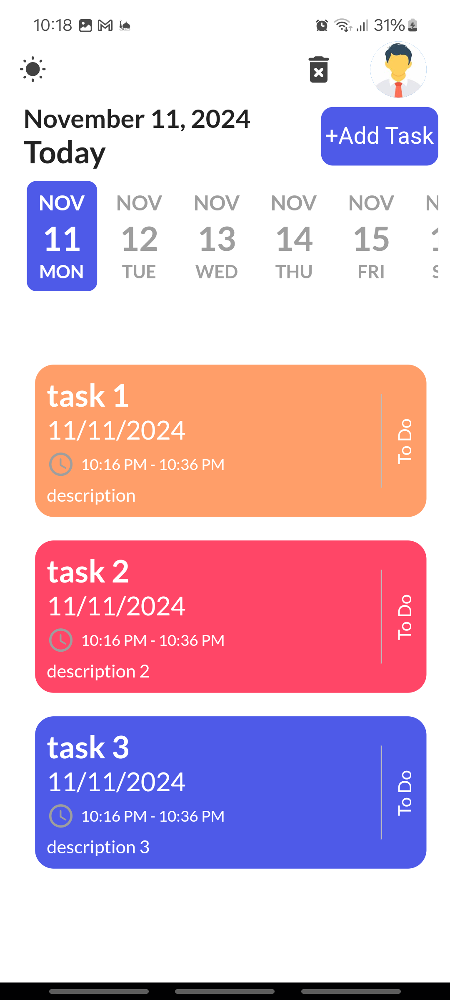
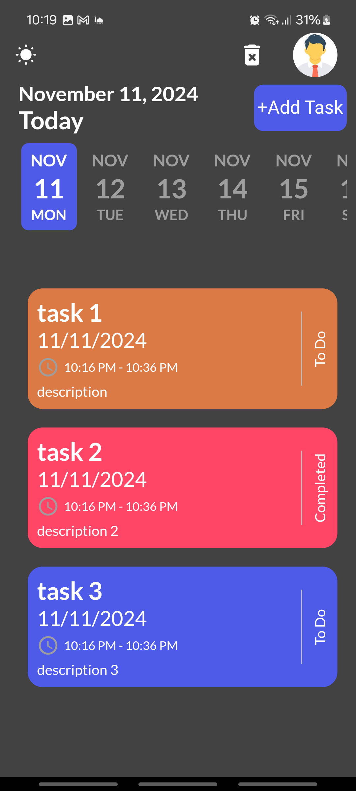
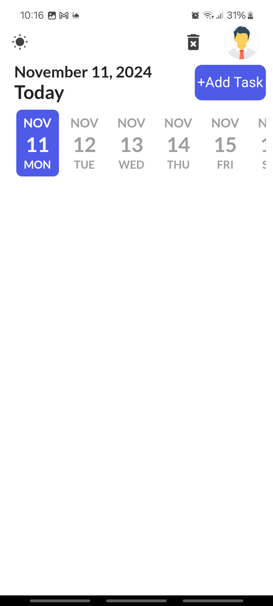
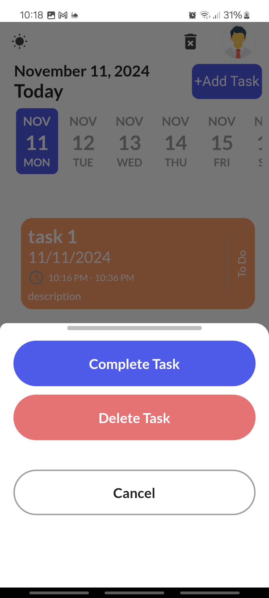

# Task Manager App ✅

A beautiful and intuitive task management app built with Flutter. This app provides a clean UI with light and dark themes and enables users to manage their tasks efficiently with features like adding, editing, deleting, and displaying tasks.

## Features
- **Add Tasks:** Easily add new tasks with title, description, and due date details.
- **Edit and Delete Tasks:** Modify or remove tasks as needed.
- **View Tasks:** Display tasks in a visually appealing layout, with options to filter by date.
- **Light and Dark Themes:** Toggle between light and dark modes to suit user preferences.
- **Animations:** Smooth animations for task transitions and UI interactions.
- **Date Selection:** Use an interactive timeline to pick task dates.

## Screenshots
| Adding task  | light home  | dark home |
|---------------|--------------|--------------| 
|  |  |  

 | emtpy tasks | editing tasks |
 |---------------|--------------|
 |  | 

## Getting Started

1. Clone the repository:
    ```bash
    git clone https://github.com/your-username/task-manager-app.git
    ```
2. Install dependencies:
    ```bash
    flutter pub get
    ```
3. Run the app:
    ```bash
    flutter run
    ```

## Dependencies
- `get`: for state management and navigation
- `get_storage`: for persistent local storage
- `google_fonts`: for custom font integration
- `date_picker_timeline`: for timeline-based date picking
- `flutter_svg`: for SVG image rendering
- `sqflite`: for local database storage
- `flutter_staggered_animations`: for smooth animations in lists
- `intl`: for date formatting and localization

